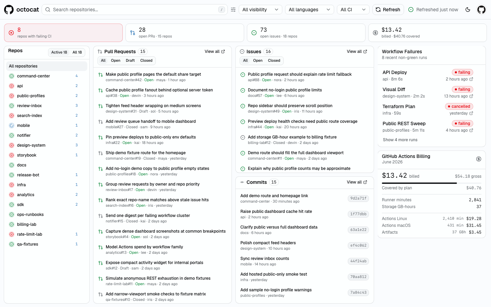

# GitHub Command Center

A focused GitHub homepage: PRs, issues, commits, CI status, workflow failures,
and Actions billing in one dense view. Hide noisy repos, dismiss stale CI
failures, and everything persists in the browser.

<picture>
  <source media="(prefers-color-scheme: dark)" srcset="docs/dashboard-dark.png">
  
</picture>

Try it without any setup: open `/demo` for a mock-data tour, or `/username`
for any public GitHub profile — no login required.

## Run locally

Requires Node.js 22.18+ and the [GitHub CLI](https://cli.github.com/) authenticated
as the account you want to inspect.

```sh
gh auth refresh -h github.com -s user   # billing needs the user scope
npm install
npm run dev
```

Open <http://127.0.0.1:5173/dashboard>. The local API answers only requests
from localhost and uses your `gh` credentials; nothing leaves your machine.

## Deploy

The standalone server (`npm start`) serves the built app. Public profile
routes work with no configuration; GitHub OAuth sign-in is optional and adds
the private `/dashboard` view with repo metadata, workflow runs, and billing.

```sh
npm ci
npm run build
npm start
```

Or with Docker:

```sh
docker build -t github-command-center .
docker run -p 3000:3000 -e BASE_URL=https://your-domain.example github-command-center
```

Configuration (see [.env.example](./.env.example)):

| Variable | Required | Purpose |
| --- | --- | --- |
| `BASE_URL` | yes | Public URL of the deployment |
| `PORT` | no | Listen port (default 3000) |
| `GITHUB_PUBLIC_TOKEN` | no | Raises GitHub API limits for no-login `/username` pages |
| `GITHUB_CLIENT_ID` / `GITHUB_CLIENT_SECRET` | for OAuth | From a [GitHub OAuth App](https://github.com/settings/developers) with callback `${BASE_URL}/auth/callback` |
| `SESSION_SECRET` | for OAuth | Cookie encryption key — `openssl rand -hex 32` |
| `TRUST_PROXY` | no | Set to `1` behind a reverse proxy so rate limits key on `X-Forwarded-For` |

Notes for OAuth deployments:

- Run behind HTTPS; cookies are marked `Secure` automatically when `BASE_URL`
  starts with `https://`.
- Tokens live in an encrypted httpOnly cookie, never on disk. Logout revokes
  the GitHub token and invalidates the session.
- The flow requests the `repo` and `user` scopes. Classic OAuth apps have no
  read-only equivalent of `repo`, so the consent screen shows broader access
  than the dashboard uses — the app only ever reads.

## Development

```sh
npm run check       # lint + typecheck + tests + production build
npm run test        # tests only
```

## License

[MIT](./LICENSE)
